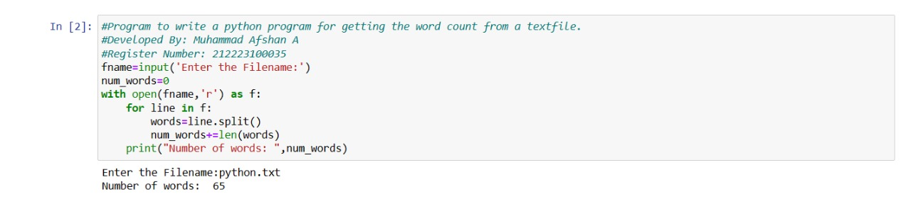
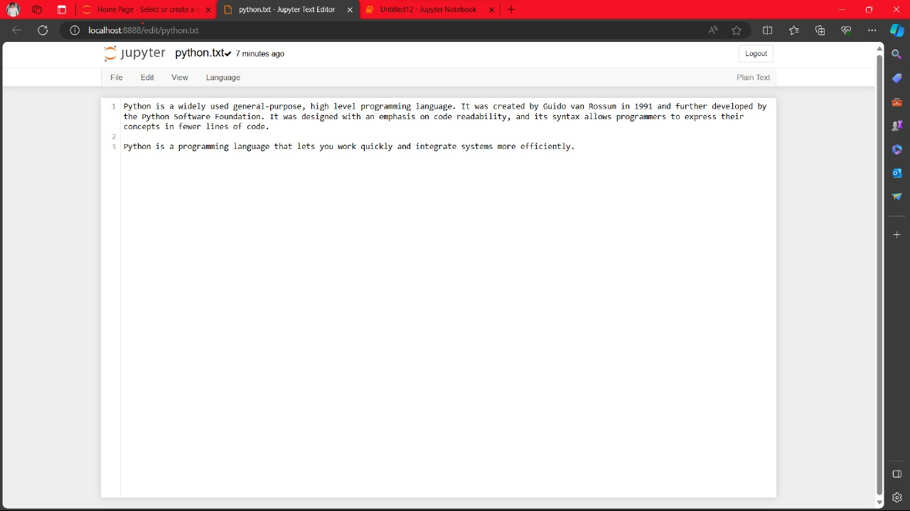

# Word-count
## AIM:
To write a python program for getting the word count from a text.
## EQUIPEMENT'S REQUIRED: 
PC
Anaconda - Python 3.7
## ALGORITHM: 
### Step 1:
User Input:

Prompt the user to enter the name of the file they want to analyze.

### Step 2:
Initialize Word Count:

Set up a variable (word_count) to keep track of the total number of words in the file, starting at zero.

### Step 3:
Open and Read File:

Use the with open statement to open the specified file in read-only mode. This ensures proper handling of the file.

### Step 4:
Iterate Through Each Line:

Use a for loop to go through each line in the opened file.

### Step 5:
Count Words in Each Line:

Split each line into words using the split method and add the count of words to the word_count variable.
## PROGRAM:
```
#Program to write a python program for getting the word count from the textfile.
#Developed by: Muhammad Afshan A
#Register Number: 212223100035
fname = input('Enter the Filename')
num_words = 0
with open(fname,'r') as f:
    for line in f:
        words = line.split()
        num_words+=len(words)
    print("Number of words: ",num_words)
```

### OUTPUT:



## RESULT:
Thus the program is written to find the word count from a text.
